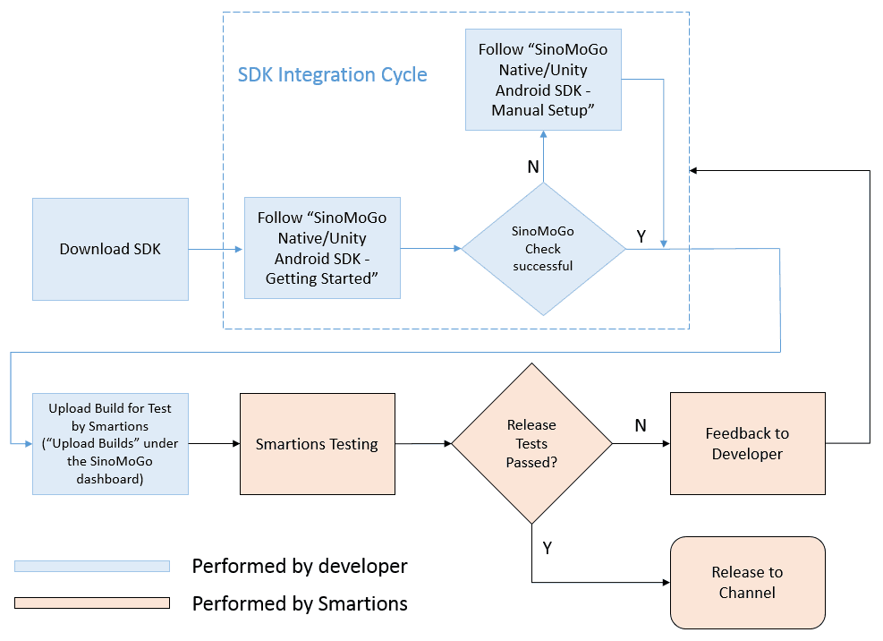
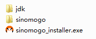
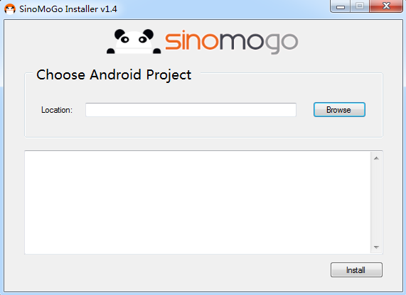
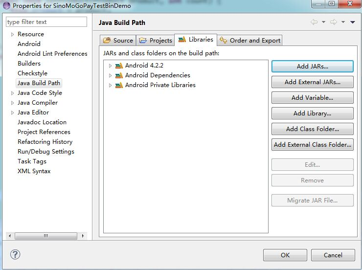
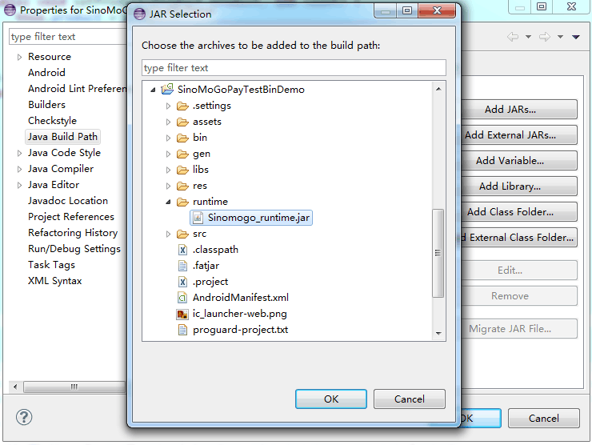
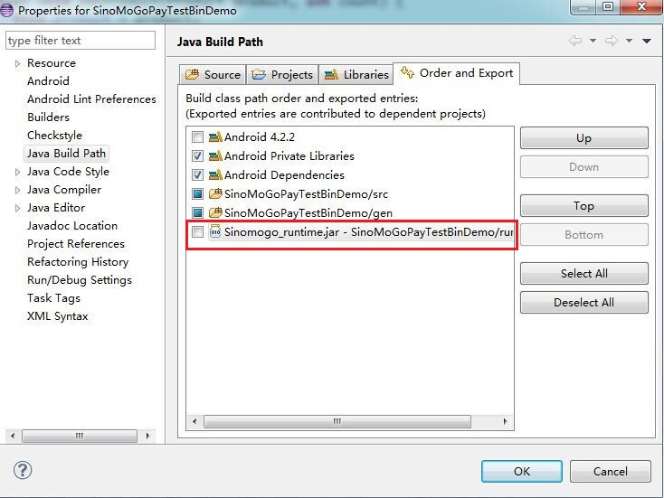
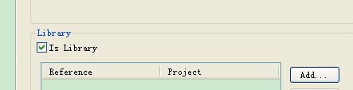
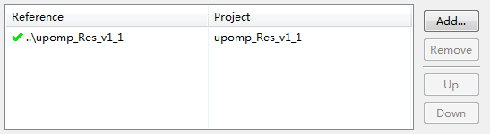
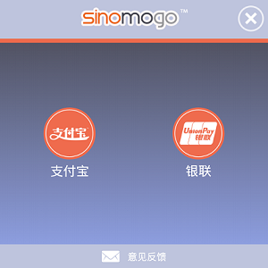
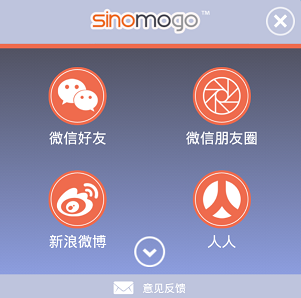

# <a id="title"></a>SINOMOGO SDK: GETTING STARTED GUIDE
## SDK INTEGRATION & API IMPLEMENTATION
Native Android "Amber Rat" Release

###1. ABSTRACT
---
This document is provided as a quick start guide to help you integrate the SinoMoGo SDK into your Android game or app and demonstrates how to you can use the SinoMoGo Pay (billing) and SinoMoGo Connect (social media sharing) plugins. 

**Notes:**
* This SDK is only intended for games and apps submitted and approved via [www.sinomogo.com] (http://www.sinomogo.com) (Smartions' Android Distriution as a Service platform for China) and requires a live SDK configuration specific to your app or game.
* Please make sure that your Android package name (e.g. `com.company.application`) and the keystore used to sign your App remain consistent during development and publishing.
* To test the SDK integration with the test configuration files (test bin files), you need to run the signed APK on a physical device. The SDK will not function correctly with an unsigned APK in an emulator.
* Once integration with the SinoMoGo SDK is complete and before submitting your build for testing by our China QA team via [www.sinomogo.com] (http://www.sinomogo.com), run the "**SinoMoGoCheckFileTool.exe**" tool found in the [SinoMoGoCheck] (../SinoMoGoCheck) folder of this SDK package and resolve any reported issues. 

###2. ENVIRONMENT
---
####2.1. Target Platform
This SDK is compatible with Android 4.0 or above.

####2.2. Debug Environment
This SDK does **NOT** work with Android emulator (AVD). Make sure you run the application on a real device during development. The examples in this document are based on Eclipse running on a windows system.

####2.3. Integration Workflow
Please review the following chart (_Fig 1._) to farmiliarize yourself with the integration workflow before you start. 

 _Fig. 1_ 



###3. SINOMOGO SDK INTEGRATION
---
####3.1. Run the SinoMoGo SDK Installer

Download this complete SDK package by navigating [here] (../) and selecting the Github "**Download Zip**" option.

Inside "**SinoMoGoInstaller**" folder of this SDK package (_Fig 2._) you will find an integration tool named "**sinomogo_installer.exe**" (_Fig 3._) which will help you to integrate SinoMoGo SDK into your App. 

The SinoMoGo installer performs the following actions:

  * It copies a number of required files (including 3rd party payment/sharing platform files) to your development folder.
  * It modifies AndroidManifest.xml file to include required configurations.

_Fig 2._ 

  

  * Click "Browse" and locate your project.
  
_Fig 3._

  
  * Click "Install" to run the installer.

> _**Note:** After the installation, Your project in Eclipse will show a bunch of errors. Those errors are caused by the lack of JAR files. The problem will be resolved after the operation in Chapter 3.3._   
  
####3.2. Configure your Application Class

**3.2.1.** In the Application class under your project, copy the following code to the onCreate method. This is necessary in order to load the required SinoMoGo libraries.

> _**Note:** If you do not already have the `onCreate` method in the Application class, you must add this method and include the following code within the method._  
  
  Your `onCreate()` method must contain the following code:
  
  ```java 
	System.loadLibrary("sinomogo");
  ```
  The Application class code must include the `onCreate` method as shown in the following example code:
  
  ```java
  public class SinomogoApplication extends Application {
	  @Override
	  protected void attachBaseContext(final Context base) {
		  super.attachBaseContext(base);
	  }
	  @Override
	  public void onCreate() {
		try {
			System.loadLibrary("sinomogo");
		} catch (Exception e) {
			System.out.println(e.getMessage());
		} finally {}
  	  }
  }
  ```
**3.2.2.** All other loading calls in your project must be moved to the main entry activity (the following code sample assumes that the main entry Activity is `HomeActivity`):
  
  ```java
  public class HomeActivity extends Activity {
	@Override
	public void onCreate() {
		try {
			//move all .so loading method except megjb/sinomogo loading calls here.
		} catch(Exception e) {}
	}
  }
  ```
**3.2.3.** Add the custom Application class name (SinomogoApplication as above) under the `<application>` tag in the **"AndroidManifest.xml"** file:

  ```xml
  <application
        android:name="CustomApplication"
        android:icon="@drawable/icon"
        android:label="@string/app_name" >
  </application>
  ```
> _**Note:** You must replace `CustomApplication` with the full name of your `SinomogoApplication` class (e.g. `com.smartions.sinomogo.demo.SinomogoApplication`)._

####3.3. Import the SinoMoGo API & SDK Config Files

After running the SinoMoGoInstaller, the file "**/runtime/Sinomogo_runtime.jar**" will be present under your project directory. This file includes the APIs of the SinoMoGo SDK.

The SinoMoGo API file must be imported into your project libraries as follows:

  - Right click the "_Properties_" of your project > "_Java Build Path_" > and select "_Libraries_" (_Fig 4._).

  _Fig 4._

  
  - Click "_Add JARs…_" (_Fig 4._), and then select **Sinomogo_runtime.jar** under the "**/runtime/**" directory (_Fig 5._).

  _Fig 5._
  
  
  
  - Click "_OK_", to complete the import of "**Sinomogo_runtime.jar**" (_Fig 5._).
  - Select "_Order and Export_" and ensure that file "**Sinomogo_runtime.jar**" option is **NOT** checked, then Click "_OK_" (_Fig 6._).
  
  _Fig 6._

  
  
> _**Note**: When packaging the APK, the "Sinomogo_runtime.jar" must **NOT** be included in the APK._ 

The "**Customer.bin**" and "**SinoMoGo.bin**" are the SinoMoGo SDK Configuration (Config) files, these must be copied to the "/assets/" directory in your project. If you have not yet received an SDK Config file set sepcific to your game or app, you can use the Test SDK Config file set included in the SDK package by default to start.


To double-check that the install completed successfully, you can run the "SinoMoGoCheckFileTool.exe" tool found in the "SinoMoGoCheck" folder. This verifies the AndroidManifest.xml updates and that the necessary resources have been copied.
For further verification that the file copy is complete you can refer to [FileList.txt](./FileList.txt).

   
> _**Note:** If the unlikely event that the SinoMoGo check fails or resources have not been copied correctly during installation, please refer to the [SinoMoGo Native Android SDK - Manual Setup] (./Troubleshooting/SinoMoGo%20Native%20Android%20SDK%20-%20Manual%20Setup.md) document for SDK manual setup steps._


###4. SINOMOGO PAY API USAGE
--- 
####4.1. Configure the UnionPay Pay Service

In order to integrate UnionPay’s payment service into your game or app, the following configuration changes must be applied to the project:

  - Import the source project "**SinoMoGoPay\Resources\upomp_Res_v1_1**". Set the same target android version as your project under "_Properties_" > "_Android_".
  - Check the "_Is Library_" checkbox under "_Properties_" > "_Android_" for project **upomp_Res_v1_1**. (_Fig 7._):
 
  _Fig 7._

  
 
  - Add the library created in the first step in this sequnce to your project under "_Properties_" > "_Android_". See (_Fig 8._):
  
  _Fig 8._

  

####4.2 Implement the SinoMoGo Pay API

The `PayService` class is the main object in the SinoMoGo Pay SDK. This class can be found within the `com.smartions.sinomogo.pay.openapi` package.

**4.2.1 Making a Payment**
   
  ```java   
	void purchase(Context context, String productId, int count) 
  ```

|    Parameter           |                          Description                                                    |
|-----------------------|-----------------------------------------------------------------------------------------|
| **`productId`**	| In-App Purchase item product ID (IDs are contained in the  game or app specific "**SinoMoGo.bin**" file). Product IDs will be provided to you in the **Recommended Item Pricing** sheet as part of the guidance from the Smartions team.       |
| **`count`**	| Quantity of the item for this purchase (usually 1).              |


  The default **SinoMoGo.bin** SDK Configuration file (test version) contains all supported billing integrations and a total of 40 test products, priced from 1 to 40 RMB (元). Product IDs are formatted the following way:
  
  ```java   
	com.smartions.sinomogo.test.product[x]
  ```
  The '**x**' is the number of the product, meaning **`com.smartions.sinomogo.test.product1`** is the first product and **`com.smartions.sinomogo.test.product40`** is the last product defined.

  The price of the test products conform to the following format:
  
|    ProductID          |      Price                        |
|-----------------------|-----------------------------------|
| com.smartions.sinomogo.test.product**1** | RMB 1  (元) | 
| com.smartions.sinomogo.test.product**11** | RMB 11 (元) | 
| com.smartions.sinomogo.test.product**40** | RMB 40 (元) | 

You can reference these product IDs during test development as described in subsequent sections of this documentation. These test products can be used to verify if your SinoMoGo Pay API integrations are working correctly.

> _**Warning:** All payment performed by user or developer will be charged even when using the test SDK configuration. Please do **NOT** sign in to make any payments using any of the connected payment services as part of testing. This will result in a charge. Once integration is complete and the Payment UI is showing to the end user with no errors, you should be done. Smartions will also thoroughly test payments in China once you have completed integration._ 

 When the `purchase()` is invoked, the payment modal UI with all available payment options will be displayed to the user (_Fig 9._ Alipay and UnionPay only in this example).
 
 _Fig 9._
 
 
 
 See the following `purchase()` code sample:
 
  ```java  
@Override
protected void onCreate(Bundle savedInstanceState) {
      super.onCreate(savedInstanceState);
  }

protected void pay(){
      String pid="com.smartions.sinomogo.test.product1";
      int count = 1;
      PayService.getInstance().purchase(this, pid, count );
  }

  @Override
  protected void onDestroy() {
     super.onDestroy();
  }
  ```
  
  **4.2.2. Payment Results**
  
  The SinoMoGo Pay service broadcasts the payment result information after each transaction:

|    Property           |                          Description                                                    |
|-----------------------|-----------------------------------------------------------------------------------------|
| **`RESULT_FLAG`**	| Indicates if the transaction was successful or not (Values: `True` or `False`).         |
| **`PRODUCT_ID`**	| The `PRODUCT_ID` property contains the product ID of the purchased item.                |
| **`PAY_WAY`**	        | Indicates which payment option the user selected in order to complete the transaction.  |
  
> _**Note**: If the end user closes the SinoMoGo Payment UI without selecting any of the payment options, the returned `PAY_WAY` value is `null`._
 
  You must implement a receiver class in your code in order to retrieve this information and verify the result of the purchase in order to update your user’s item or virtual currency balance. The method used to retrieve payment results and details is the `onReceive` method:
  
  ```java  
super.onReceive(context, intent);
  ```
  You must invoke the `onReceive` method above in order to retrieve the payment details. The following "`PayResultIntentReceiver`" demo class is an example of how this can be implemented (this class must inherit from the `ParentPayReceiver`):

  ```java 
	public class PayResultIntentReceiver extends ParentPayReceiver {
		@Override
		public void onReceive(Context context, Intent intent) {
	super.onReceive(context, intent);
	//Obtain transaction result
		if(RESULT_FLAG){ //Transaction Successfully
				//Obtain payment platforms
				Platform platform = Platform.valueOf(PAY_WAY);
				switch(platform){
					case alipayclient:
						//Alipay
						toast(context);
						break;
					case unionpay:
						//UnionPay
						toast(context);
						break;
		}
	}else{ //Transaction failure
				toast(context);
		}
		}
	    public void toast(Context context){
			Toast.makeText(context, "<SinoMoGoPay>:"+"productId:=" + PRODUCT_ID + ",resultFlag:=" + RESULT_FLAG + ",payWay:=" + PAY_WAY, Toast.LENGTH_LONG).show();
		}
	}
  ```

###5. SINOMOGO CONNECT API
---

####5.1. Implement the SinoMoGo Connect API
	
The `ShareService` singleton is the main object in the SinoMoGo Connect SDK. You can find it within the package `com.smartions.sinomogo.connect.openapi`.

#####5.1.1. Sharing Content

The `shareAction()` method can be used to share content across supported Chinese social networks and will display a modal UI with all available sharing options to the user (_Fig 10._ WeChat, Sina Weibo, Tencent Weibo, RenRen in this example). 

_Fig 10._

 

See the following method description for the `shareAction()` method:

```java
	void shareAction(Context context, String content, String imagePath, String wechatImage, SNSType snsType, String url);
```


|    Parameter          |                          Description                                                    |
|-----------------------|-----------------------------------------------------------------------------------------|
| **`content`**	        | String type. The content to be shared.                                                  |
| **`imagePath`**	| Path to the image to be shared on Sina Weibo, Tencent Weibo, and RenRen social networks. Set to `null` if you don’t want to share any image. Must be a local image from the device or a URL for an online image. We recommend 640*640 images with a maximum size of 1MB.             |
| **`wechatImage`**	| Path to the image to be shared on WeChat. Must be a local icon image from the device or a URL for an online image. We recommend using 72*72 image with a maximum size of 32KB.              |
| **`snsType`**	| Platform to which the content will be posted (see following table).               |
| **`url`**	| URL of a web site which is linked in sharing. This URL will be provided to you in your game or app guidance report or by the Smartions team. **Null value not allowed**.             |


The `snsType` parameter in the code above can be used to target specific Chinese social networks:


|    snsType          |                          Description                                                    |
|-----------------------|-----------------------------------------------------------------------------------------|
|    `SNSType.ALL`        |    Display all sharing options to the user (defined in SinoMoGo.bin).                    |
|    `SNSType.SINA`         |  Sharing via Sina Weibo only.                                                   |
|    `SNSType.TENCENT`       |    Sharing via Tencent Weibo only.                                                  |
|    `SNSType.RENREN`        |    Sharing via RenRen only.                                                   |
|    `SNSType.FRIEND`        |    Sharing with a particular WeChat friend or friend group chat.                       |
|    `SNSType.GROUP`          |   Sharing on WeChat via "WeChat Moments" (similar to Facebook wall).    |

> _**Note**: Unless otherwise directed by the Smartions team in your game or app Guidance Report, `SNSType.ALL` should be used in all sharing points within your game or app to enable the user to select their prefered social network._   

See the following example for sharing using `shareAction()`:
 
  ```java  
@Override
protected void onCreate(Bundle savedInstanceState) {
      super.onCreate(savedInstanceState);
    }

protected void shareAll(){

      String content = "Test Content";
      String imagePath = Environment.getExternalStorageDirectory() + "/SinoMoGoDemo/share.png";
      String wechatImage= Environment.getExternalStorageDirectory() + "/SinoMoGoDemo/share.png";
      String url="http://www.sinomogo.com";
      ShareService.getInstance().shareAction(mContext,content,imagePath, wechatImage,SNSType.ALL,url);
    }

protected void shareSina(){

      String content = "Test Content";
      String imagePath = "http://www.smartions.com/moregames/images/smartions.png";
      String wechatImage = "http://www.smartions.com/moregames/images/smartions.png";
      String url="http://www.sinomogo.com";
      ShareService.getInstance().shareAction(mContext,content,imagePath, wechatImage,SNSType.SINA,url);
    
}

    @Override
    protected void onDestroy() {
        super.onDestroy();
    }

  ```
 
#####5.1.2. Share Results

After each `shareAction()`, the SinoMoGo Connect will broadcast the share result information. This information contains the following:

|    Property          |                          Description                                                    |
|-----------------------|-----------------------------------------------------------------------------------------|
|    `SHARE_FLAG`        |    Result flag which indicates if the share was successful or not. (Values: `True` or `False`).                    |
|    `SHARE_TYPE`         |  Indicates the platform the user selected for the share.                                                   |


> _**Note**: If the end user closes the SinoMoGo UI without selecting any of the sharing options, the returned `SHARE_TYPE` value is `null`._ 

The following `ShareResultIntentReceiver` class demonstrates how share results can be handled:

```java
	public class ShareResultIntentReceiver extends ParentConnectReceiver {
		@Override
		public void onReceive(Context context, Intent intent) {
	        super.onReceive(context,intent);
		if (SHARE_FLAG) { 	//shareSuccess
				//Obtain sharing platforms
				Platform platform = Platform.valueOf(SHARE_TYPE);
				switch(platform){
				case sina:
					//SINA 
					toast(context);
					break;
				case tencent:
					//TENCENT 
					toast(context);
					break;
				case renren:
					//RENREN
					toast(context);
					break;
				case friend:
					//WeChat friend
					toast(context);
					break;
				case group:
					//WeChat Moments
					toast(context);
					break;
				}
			}		
		}
		public void toast(Context context){
	Toast.makeText(context,SHARE_TYPE+"--"+SHARE_FLAG,Toast.LENGTH_LONG).show();
		}
	}
```


###6. SINOMOGO EXCEPTION CODE LIST
---

|    Exception Code         |      Exception Description (English)         |异常描述 (简体中文)|
|-----------------------|-----------------------------------|-----------------------------------|
|   10001         |      Your SinoMoGo Key is null or invalid. Please contact Smartions technical support.        | SinoMoGo.bin没有配置APPId或APPId无效。请联系斯曼森信息技术公司技术支持人员 |
|    10002         |   The `PayUI(Activity)` is not configured in the AndroidManifest.xml         | `PayUI(Activity)`没有在AndroidManifest.xml中注册 |
|    10003         |      The SinoMoGo.bin file is not configured correctly, please contact Smartions technical support.        | SinoMoGo.bin配置错误,请联系斯曼森信息技术公司技术支持人员。 |
|    10004         |      Resource Missing: SinoMoGo SDK Image is not found, please contact Smartions technical support.         | 资源缺失:SDK图片不存在,请联系斯曼森信息技术公司技术支持人员 |
|    10005         |      `ProductId` is invalid       | 商品ID参数错误|
|   10007        |      Invalid verification value (MD5)       | 无效校验码 (MD5) |
|    10008        |      Verification failed (Error in SinoMoGo.bin file content)      | 验签失败(SinoMoGo.bin文件内容有错) |
|    11001         |    The `AlipayUI(Activity)` is not configured on AndroidManifest.xml         | `AlipayUI(Activity)`没有在AndroidManifest.xml中注册 |
|    14001        |      File Resource Missing:China UnionPay SDK is not found         | 文件资源缺失：中国银联 SDK不存在 |
|    20001        |      Your SinoMoGo Key is null or invalid. Please contact Smartions technical support.         | SinoMoGo.bin没有配置AppId或AppId无效。请联系斯曼森信息技术公司技术支持人员 |
|    20002        |	The ShareActivity(Activity) is not configured in AndroidManifest.xml        |	ShareActivity(Activity)没有在AndroidManifest.xml中注册        |
|    20003        |	The ShareUI(Activity) is not configured in AndroidManifest.xml        |	ShareUI(Activity)没有在AndroidManifest.xml中注册        |
|    20004        |	Resource Missing: SinoMoGo SDK Image is not found, please contact Smartions technical support.      |	资源缺失:SDK图片不存在,请联系斯曼森信息技术公司技术支持人员        |
|    20005        |	The SinoMoGo.bin file is not configured correctly, please contact Smartions technical support.    |	SinoMoGo.bin配置错误,请联系斯曼森信息技术公司技术支持人员。        |
|    20007        |	Invalid verification value (MD5)        |	无效校验码 (MD5)        |
|    20008        |  Verification failed (Error in SinoMoGo.bin file content)  |  验签失败(SinoMoGo.bin文件内容有错)    |
|    21001        |	The link address sharing with Wechat can't be empty     | 微信分享链接地址不能为空        |
