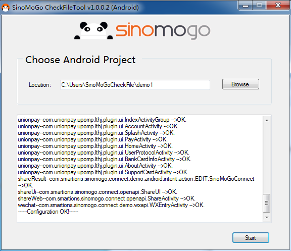
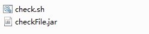

 
 
# SINOMOGO SDK FILES CHECKER
## Native for Android

The SinoMoGo SDK File Checker is a tool which helps to verify that all required files are present in the correct location after the SinoMoGo SDK integration has been completed. 

**For Windows:** 
If the development environment is Windows, use the tool by running the provided "**SinoMoGoCheckFileTool.exe**" file found in the folder "**windows**". 

 _Fig SinoMoGoCheckFileTool.exe_ 

  
 
Below is a screenshot of the tool's interface:
 
 
 _Fig SinoMoGoCheckFileTool_ 

  

- Click on the "**Browse**" button and select your project folder (which already has the SinoMoGo SDK integrated).
- Click the "**Start**" button to start the checking process.
- A successful pass will display a message saying "**Checking completed, no errors found**".
- In case there are errors reported ( "**Not configured**" or  "**Not found**" messages) please check the log against the [FileList.txt] (../Documentation/FileList.txt) and amend any errors by copying the missing files to their correct location.

 **For Linux:** 

  

- Open terminal and execute the below command with appropriate user permission:
sh "**./<shellPath>/check.sh**" "**./<projectPath>**".
<shellPath> should be the location where `check.sh` resides.
<projectPath> should be your project path
- A successful pass will display the "**Configuration OK!**" and "**File OK!**" messages.
- In case there are errors reported ("**Not configured**", "**Not found**" messages) please check the log against the [FileList.txt] (../Documentation/FileList.txt) and amend any errors by copying the missing files to their correct location.
